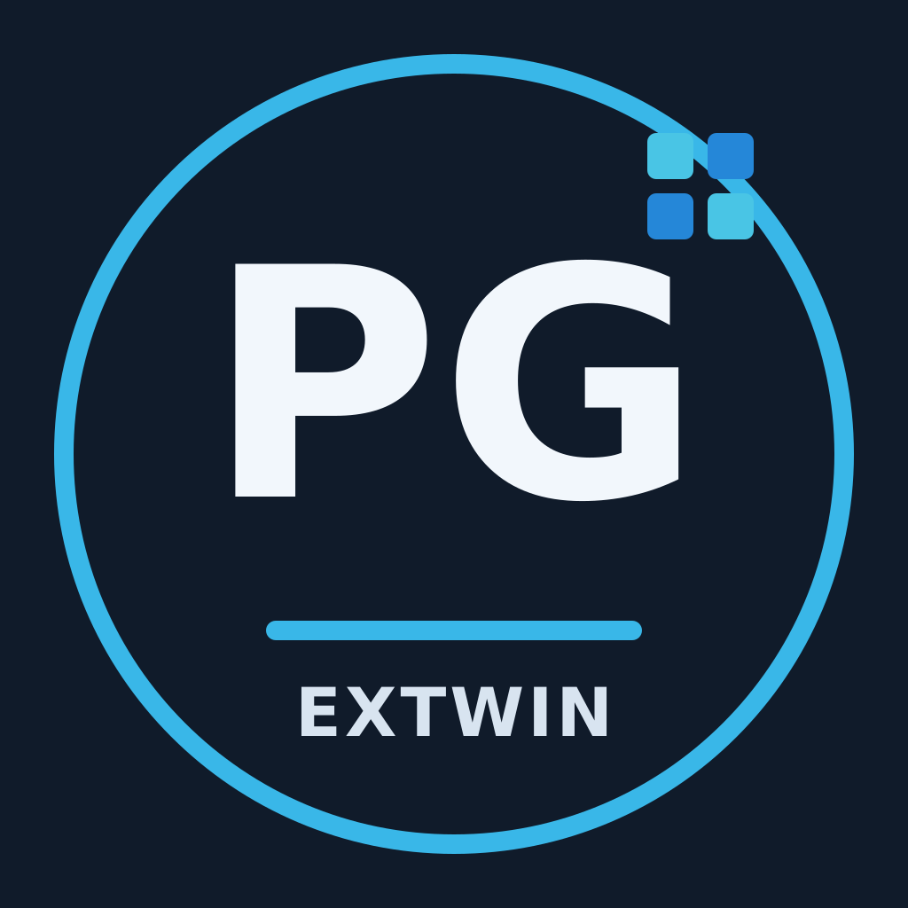

# PostgreSQL Extensions for Windows

**Unofficial Windows x64 binaries for PostgreSQL extensions.**

pgextwin is an independent community project that builds and publishes Windows x64 binaries for selected PostgreSQL extensions. The goal is to make useful extensions easier to install with standard Windows PostgreSQL distributions, including the standard EDB PostgreSQL installer, without requiring every user to build from source.

## Project repositories

- [build](https://github.com/pgextwin/build) — shared Windows CI/CD, PostgreSQL lifecycle metadata, hook contracts, and manifest schema
- [catalog](https://github.com/pgextwin/catalog) — machine-readable extension catalog for the website and future CLI
- [website](https://github.com/pgextwin/website) — static catalog-driven website source

The pg_bigm pilot has completed technical validation across PostgreSQL 14–18 and is pending transfer into this Organization.

## Compatibility and installation

Each release will identify the upstream extension version, supported PostgreSQL major version, Windows architecture, and installation steps. Match those details to your PostgreSQL installation and read the extension's upstream documentation before installing.

## Upstream projects and licenses

This organization is not the upstream home of the extensions. PostgreSQL, EDB, and the individual upstream projects are independent of pgextwin; this project is not affiliated with or endorsed by them. Each extension remains subject to its upstream license and notices. Check the source project's license and the release notes for the exact terms that apply to each distribution.

---

# Windows向けPostgreSQL拡張機能

**PostgreSQL拡張機能の非公式Windows x64バイナリを配布するコミュニティプロジェクトです。**

pgextwinは、選定したPostgreSQL拡張機能を標準的なWindows版PostgreSQL環境で利用しやすくするため、Windows x64向けバイナリのビルドと配布を行います。標準的なEDB版PostgreSQLインストーラーなどでの利用を目指します。

## プロジェクトリポジトリ

- [build](https://github.com/pgextwin/build) — 共通Windows CI/CD、PostgreSQLライフサイクル情報、hook仕様、manifest schema
- [catalog](https://github.com/pgextwin/catalog) — Websiteと将来のCLIが利用する機械可読catalog
- [website](https://github.com/pgextwin/website) — catalog駆動の静的Websiteソース

pg_bigm pilotはPostgreSQL 14〜18で技術検証を完了しており、現在このOrganizationへのrepository移管待ちです。

## 対応状況と導入方法

各リリースに、拡張機能の上流バージョン、対応するPostgreSQLメジャーバージョン、Windowsアーキテクチャ、導入手順を記載します。ご利用のPostgreSQL環境と対応情報が一致することを確認し、導入前に上流プロジェクトの説明もご確認ください。

## 上流プロジェクトとライセンス

このOrganizationは拡張機能の上流開発元ではありません。PostgreSQL、EDB、各拡張機能の上流開発元とは独立しており、提携・承認を示すものではありません。各拡張機能には上流のライセンスと著作権表示が適用されます。配布物ごとの条件は、上流のライセンスおよび各リリースの説明をご確認ください。
